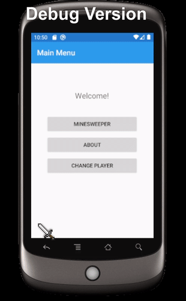
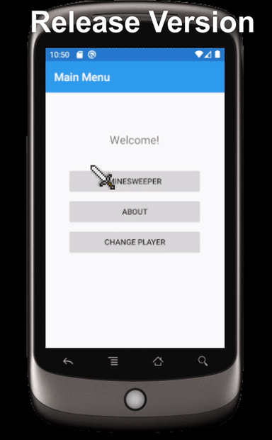

# HoanGames
Xamarin Minesweeper project created for an interview.
Features:
- Fully utilizing MVVM architecture with data binding
- Responsive and intuitive UI design
- Recursive logic used to reveal the cells
- More features to come (save game, high scores, etc.)

Preview: (Debug version shows mine generation)

